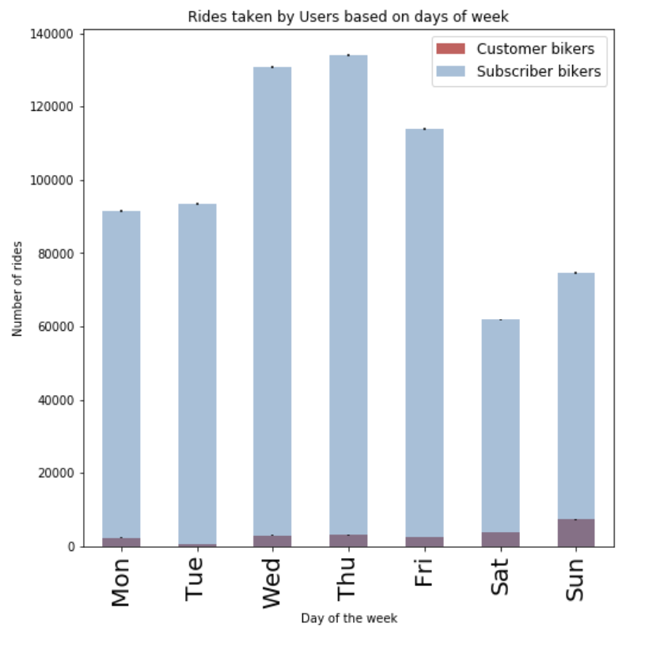
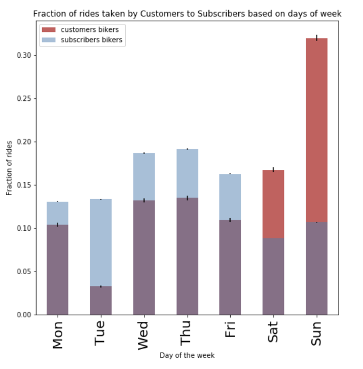

# Citibike HW3_Assinment2 Review
### reviewing [pak348 Ipython notebook](https://raw.githubusercontent.com/danachermesh/PUI2017_pak348/master/HW3_pak348/Homework_3_Assignment_2_pak348.ipynb)

#### (a) Null and alternative hypotheses
The Null hypothesis was formulated correctly, though the **\alpha was not stated**.

The Alternative hypothesis was formulated correctly, though the **\alpha was not stated**. Moreover, instead of writing "Subscribers take **_more_** rides on Citibikes than Customers during Weekdays" it would be better to write **"..._significally_ more..."**

#### (b) Verify that the data supports the project

* I am referreing for the UserType/Tripduration and not reviewing the efforts to analyze age of bikers. 

**Figure 1a:** Distribution of Citibike bikers by Customer types in July 2017, absolute counts

and

**Figure 1b:** Distribution of Citibike bikers by Customer types in July 2017, absolute counts, with statistical errors

and

**Figure 1c:** Distribution of Citibike bikers by Customer types in July 2017, Normalized

The data supports the project.\ 
However, considering the question is reffering for weekdays only, Saturday and Sunday information could have been neglected.

I would have suggest, instead of overseeing weekend data, to try and assess the differences between weekdays and weekends.

#### (c) Chose an appropriate test to test H0 given the type of data
