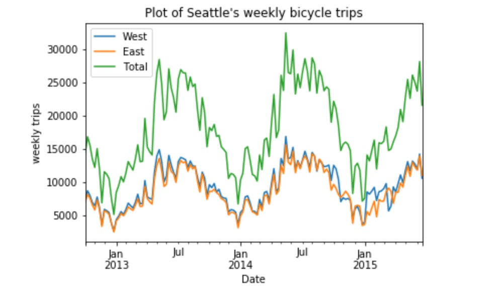

# Cheng's Homework 8

I plot the tendency of bicycles trips in Seattles from 2012- 2016.

# Plotting:

**Figure 1:** Changing of the number of Seattle's bicycle trips ( from west and east sidewalks and sum them up) as time goes from 2013-2015

West line shows the number change of the west sidewalk.
Orange line shows the number change of the east sidewalk.
Green line shows the total number change tendency.
The plot directly shows that the citizens of Seattle are more active in summer than in winter.
What's more, more people choose bicycle as the tool for movement with year increases.
And the people in west sidewalk are more active than who in east sidewalk.

-----

# Dana's Comments for Cheng's plot, HW9:

The plot's title, labels, x and y ticks and legend exist and positioned correctly and clearly. The Figure has caption and Though, several thoughts of how this plot could have been improved:

- **Content:** It is not clear what does the number of trips stand for - is it monthly? daily? hourly? - After viewing the code of the plot I understood it is the _hourly number_ of bicycle trips in the west or east sidewalk of the Fremont Bridge. It could have been better either show the change by hour **or** by month, or daytime/nightime in each month.  
From the title the observer understands that this is the data of _all_ of Seatle bicycle trips and has no ides about the Fremont Bridge, which maked the title slightly misleading.
- **Kind of plot:** Continuing with the above way of thinking: A **bar plot** might have given us a more straitforward understanding of the data. Also, having the _total_ line makes the west/east lines too close and hence the differences between them insignificant. Using bar plot could have been useful in this sense, too: the bars of east/west could have been _stacked_ and you could have annotate the total number at the top of the stacked bar. 
- **Colors:** The _green_ clolor of the total # and the _orange_ color of the east # will look too similar to blind-color people with Deuterwanopia and Protanopia disorder. The _green_ and the _blue_ lines will be observed as the same color by those who have Tritanopia disorder.
